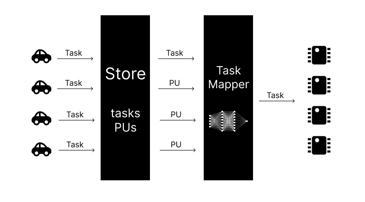

# SIMPY-AD

## Version 1



### Launch Simulation

## Python

Python 3.9 is used. Below versions might not work as typings and annotations are used everywhere

## clone

```bash
git clone https://github.com/Houarnoughi/Simpy-AD.git
cd Simpy-AD
```

## Install dependencies

```bash
pip3 install -r requirements.txt
or
python3 -m pip install -r requirements.txt
```

# Run Simulation

Configure simulation in simpyad/config.py

## Flask Web App

```bash
python3 app.py
```

## Script

```bash
python3 simpyad/SimulationScenario.py
```

# Extend Simulation

### Network

```python
class Network(ABC):
    @abstractmethod
    def getTransferDuration(data: int):
        """ implemented by child classes """

    @abstractmethod
    def getUploadSpeed() -> int:
        """ implemented by child classes """
        
    @abstractmethod
    def getDownloadSpeed() -> int:
        """ implemented by child classes """
```

Create new class that extends Network

```python
class Fibre(Network):
    DOWNLOAD = 200 * Units.mega
    UPLOAD = 150 * Units.mega

    def getTransferDuration(data: int) -> float:
        return data/ (LTE_PLUS.UPLOAD/8)
    
    def getUploadSpeed() -> int:
        return LTE_PLUS.UPLOAD
    
    def getDownloadSpeed() -> int:
        return LTE_PLUS.DOWNLOAD
```
and add to UI_OPTIONS to include it in dropdown

```python
UI_OPTIONS = [
    LTE, LTE_PLUS, Fibre
]
```

## References:
- Emmanuelle Grislin-Le Strugeon, Hamza Ouarnoughi, Smaïl Niar: "A Multi-Agent Approach for Vehicle-to-Fog Fair Computation Offloading". 17th IEEE/ACS International Conference on Computer Systems and Applications, AICCSA 2020, Antalya, Turkey, November 2-5, 2020
- Hamza Ouarnoughi, Emmanuelle Grislin-Le Strugeon, Smaïl Niar: "Simulating Multi-agent-based Computation Offloading for Autonomous Cars". To appear in Cluster Computing, Springer, 2021.
